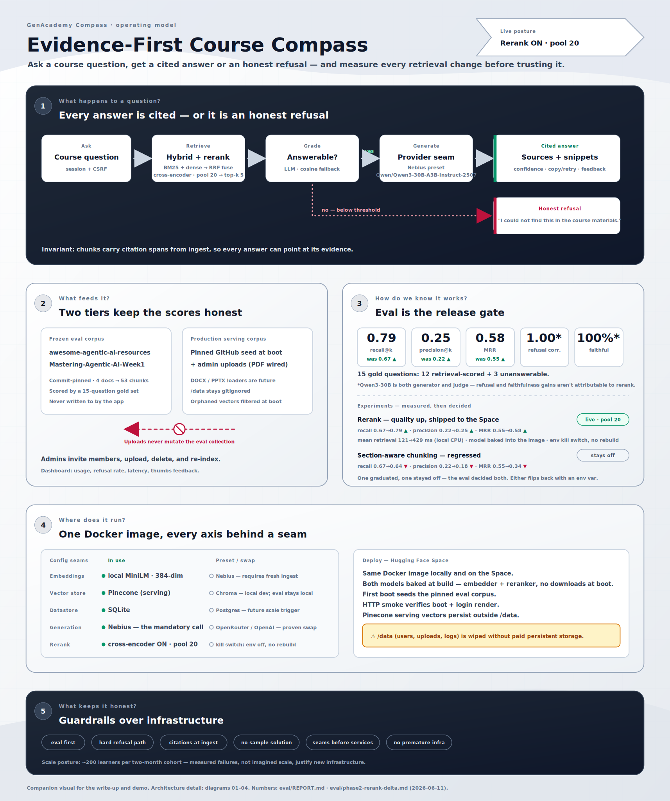

# GenAcademy RAG

Knowledge assistant for Gen Academy cohort materials. It retrieves from course content, answers with
citations, and refuses when the materials do not support an answer.

The user-facing app title is **GenAcademy Compass**. The repository, package, and technical docs keep
the GenAcademy RAG name.

## Visual Overview



## Current Status

- Hybrid retrieval with cited answers and refusal-first behavior.
- GenAcademy Compass UI shell for chat, auth, and admin workflows.
- Admin upload, invite, usage-log, and feedback flows.
- Answer trust UX: confidence badges, source links/snippets, copy/retry, disclaimer, and thumbs
  feedback.
- Phase 2 presets for Pinecone, Nebius embeddings, rerank, section-aware chunking, and Docker/Hugging
  Face Space deployment.

See `docs/minimal-system-design.md` for the current scale posture: keep this project
scale-aware, not scale-overbuilt. SQLite remains acceptable for the course demo; Postgres is deferred
until persistence or multi-instance needs justify it.

## Local Run

```bash
uv run python scripts/ingest_eval_corpus.py
uv run uvicorn genacademy_rag.web.main:app --host 0.0.0.0 --port 7860
```

## Verification

```bash
uv run ruff check .
uv run pytest
GENACADEMY_RERANK_ENABLED=false GENACADEMY_EMBEDDINGS=local uv run python scripts/eval_retrieval.py --collection eval
```

## Deploy

See `docs/deploy.md` for Hugging Face Space variables, secrets, first-boot corpus seeding, and smoke
checks.
